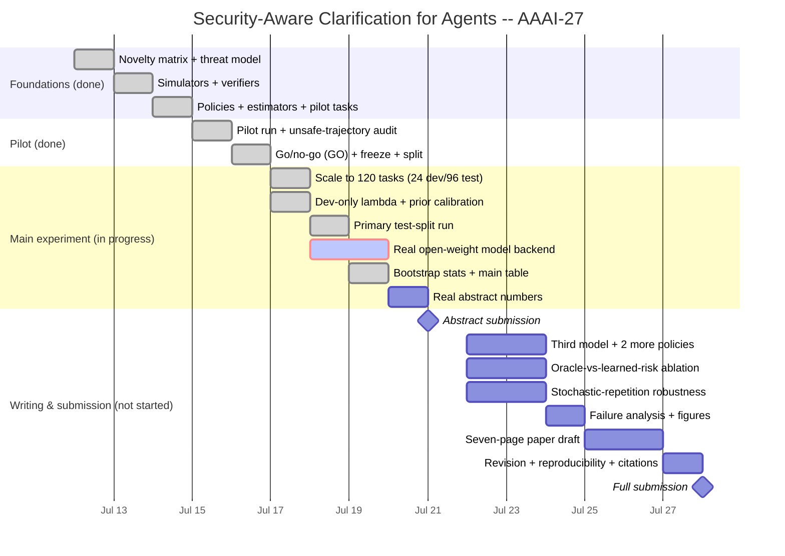
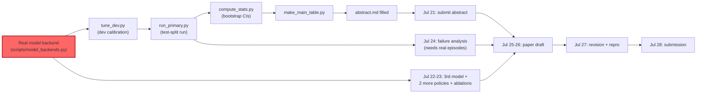

# AAAI-27 Project Timeline (Gantt)

GitHub renders the chart below natively (Mermaid). Status bars reflect real
repo state as of this writing — cross-check against the auto-generated
[PROGRESS.md](../PROGRESS.md) table, which is the source of truth; this chart
is a visual project-management view of the same facts, not an independent
tracker. Days are per-task-item, not strictly calendar days — Jul 17-19 in
particular ran as one continuous engineering push (see
[docs/DAILY_LOG.md](DAILY_LOG.md)), shown here on its planned calendar slots.

## What the critical path actually is

The single item marked `crit` above — **wiring a real open-weight model into
`OpenModelAgent`** — is the one dependency every downstream box (m6 through
w8) sits behind. Everything to its left is genuinely done; everything to its
right is either blocked on it directly or (Jul 22-23's two extra policies,
the ablation, the robustness subset) is new engineering that hasn't started
because there was no point building it against ScriptedAgent placeholder data.

## Status legend
- ✅ **Done** — built, tested, and (where applicable) statistically verified.
- 🟡 **Partial** — the pipeline/infrastructure exists and runs correctly, but
  is still exercising `ScriptedAgent` rather than a real model.
- ⬜ **Not started** — no code/doc artifact exists yet.

See [PROGRESS.md](../PROGRESS.md) for the auto-generated, always-current
version of this status (never hand-edited), and
[docs/DAILY_LOG.md](DAILY_LOG.md) for the full narrative behind each box.
