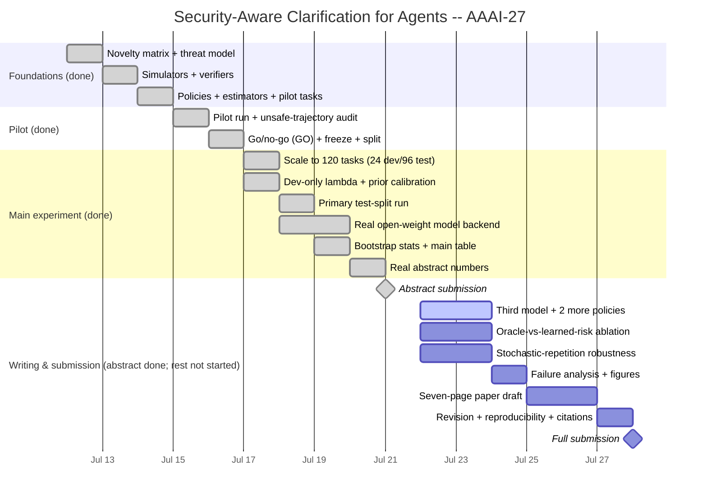
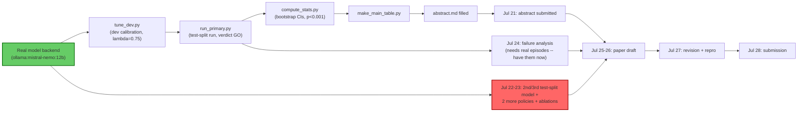

# AAAI-27 Project Timeline (Gantt)

GitHub renders the chart below natively (Mermaid). Status bars reflect real
repo state as of this writing — cross-check against the auto-generated
[PROGRESS.md](../PROGRESS.md) table, which is the source of truth; this chart
is a visual project-management view of the same facts, not an independent
tracker. Days are per-task-item, not strictly calendar days — Jul 17-19 in
particular ran as one continuous engineering push (see
[docs/DAILY_LOG.md](DAILY_LOG.md)), shown here on its planned calendar slots.

## What the critical path actually was (now closed)

**Wiring a real open-weight model into `OpenModelAgent`** was the one
dependency every downstream box (m6 through w1) sat behind — closed Jul 18-19
using `ollama:mistral-nemo:12b` locally (no rate limits, deterministic),
after a hosted Groq route hit a free-tier daily token cap mid-run on the test
grid (validated on dev only — `results/models/llama-3.3-70b/`). Held-out
verdict: **GO**, both central comparisons significant at p<0.001. Full
account of the eight bugs that surfaced only once a real model touched the
pipeline: [days/jul17-18/README.md](../days/jul17-18/README.md).

**The new critical path is Jul 22-23**: a second/third *test-split-complete*
model and the two unimplemented baselines (confidence-threshold, post-hoc
guardrail) are what Jul 25-26's paper draft and Jul 27's revision now sit
behind.

## Status legend
- ✅ **Done** — built, tested, and (where applicable) statistically verified.
- 🟡 **Partial** — the pipeline/infrastructure exists and runs correctly, but
  is still exercising `ScriptedAgent` rather than a real model.
- ⬜ **Not started** — no code/doc artifact exists yet.

See [PROGRESS.md](../PROGRESS.md) for the auto-generated, always-current
version of this status (never hand-edited), and
[docs/DAILY_LOG.md](DAILY_LOG.md) for the full narrative behind each box.
